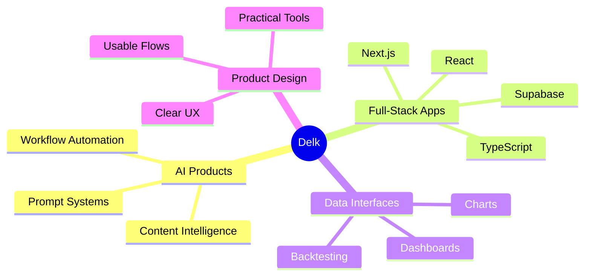

# Hi, I'm Delk

<div align="center">


[](https://git.io/typing-svg)

</div>

---

## SYSTEM PROFILE

```txt
Name        : Delk
Mode        : Independent Builder
Focus       : AI Apps / Full-Stack Web / Automation / Product Prototypes
Stack       : Next.js, React, TypeScript, Python, Supabase
Principle   : Build useful tools first. Polish after the core works.
```

I build small but complete software products: tools with clear workflows, useful interfaces, and enough engineering depth to become real projects rather than demos.

Current interests:

- AI-native productivity tools
- Web applications with strong product interaction
- Financial analysis and portfolio simulation
- Video, transcript, and content intelligence
- Automation workflows that reduce repetitive work

---

## FEATURED BUILDS

### XiaoLiJi / 小理基

AI-powered fund portfolio analysis and simulation app.

`Next.js` `React` `TypeScript` `Supabase` `Recharts` `DeepSeek`

- Fund screening, search, and market overview
- Portfolio simulation with holdings, cash, profit, and NAV refresh
- Multi-factor portfolio diagnostics and radar scoring
- Backtesting against major indices
- AI-generated "chef review" reports for portfolio analysis
- Risk questionnaire and personalized allocation suggestions

[Repository](https://github.com/Delk/xiaoliji)

### Universal Video Insight Extractor

Cross-platform transcript extraction tool for turning online videos into clean, reusable text.

`Python` `Whisper` `Gradio` `FFmpeg` `Automation`

- Extracts subtitles or audio transcripts from online videos
- Supports YouTube, Xiaohongshu, Bilibili, TikTok, Douyin, and more
- Uses official subtitles when available
- Falls back to Whisper AI transcription when needed
- Cleans, merges, and formats transcripts into readable Markdown

---

## TECH RADAR

<div align="center">


</div>



---

## BUILDING STYLE

I like products that feel direct, useful, and alive:

- Interfaces should help users make decisions, not just display data.
- AI should explain, summarize, and reduce work instead of adding mystery.
- Small tools are worth building when they remove real friction.
- A project is not finished when the code runs; it is finished when the workflow feels clear.

---

## GITHUB SIGNALS

<div align="center">


</div>

<div align="center">


</div>

---

## CURRENT SIGNAL

```txt
Building        : AI + web products
Learning        : Better product systems, cleaner automation, sharper UI
Optimizing      : From rough prototype to usable tool
Open to         : Practical collaborations, useful ideas, and ambitious small products
```

<div align="center">


</div>
